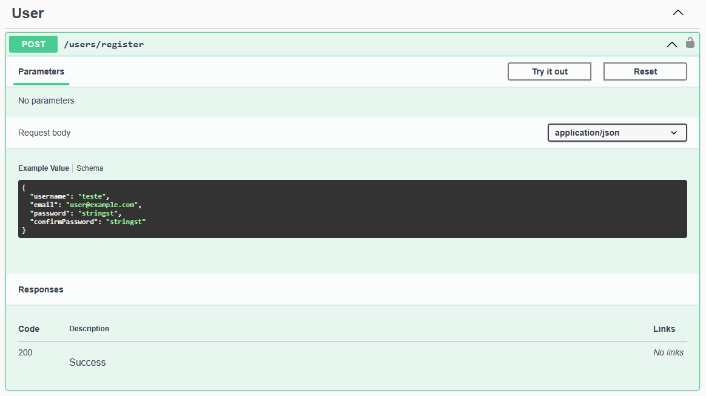

# ViaCEP Consumer API 
## Introdução
Este projeto consiste em uma Web API criada utilizando o .NET 6. Nele, o usuário pode realizar consultas informando um CEP, após ter um cadastro e um token de acesso válido.

## Pré requisitos
| Nome | Link |
| :--- | :---: |
| Docker | https://docs.docker.com/get-docker |

> :bulb: Para maiores informações sobre a instalação, consulte a documentação oficial em: https://docs.docker.com/manuals.

## Instalação
### 1) Fazendo o download ou clonando o projeto
Para fazer o download do repositório, clique [aqui](https://github.com/julioschuambach/viacep-consumer-api/archive/refs/heads/main.zip).

Para clonar o projeto, utilize o comando `git clone https://github.com/julioschuambach/viacep-consumer-api.git` em um diretório de sua preferência.

### 2) Navegue até o diretório do projeto
Uma vez com o projeto em seu ambiente local, navegue até o diretório do projeto de Api (`./viacep-consumer-api\ViaCepConsumer\ViaCepConsumer.Api`).

> :bulb: Caso você tenha optado por realizar o download do repositório, precisará realizar a descompactação do arquivo `.zip`.

### 3) Compondo a aplicação
Estando no diretório do projeto de Api, abra um terminal de sua preferência e execute o comando `docker compose --project-name viacep-consumer-api up -d` para compor a aplicação junto de suas dependências.

Após a execução do comando acima, aguarde até que todos os downloads e instalações sejam finalizados. Uma vez finalizados, o projeto estará rodando em seu ambiente local.

> :bulb: Para certificar-se de que tudo está rodando conforme o esperado, pode-se utilizar o comando `docker ps` em seu terminal.

## Como utilizar
Após todos os passos de instalação, você conseguirá realizar as requisições enquanto a aplicação e suas dependências estiverem rodando.
<details>
<summary>Docker Desktop</summary>

</details>

### Utilizando o Swagger UI
Acesse a página do Swagger através do link `http://localhost:1234/swagger/index.html`, ou clicando [aqui](http://localhost:1234/swagger/index.html).
<details>
<summary>Swagger UI - Home</summary>

</details>

#### Cadastrando um novo usuário
Para realizar as requisições do ViaCEP Web Service, é necessário que você possua um usuário cadastrado. Cadastre-se através do endpoint `/users/register` informando no corpo da requisição os dados necessários.
<details>
<summary>Endpoint para cadastro de usuário</summary>

</details>

#### Realizando o login
Após ter seu cadastro efetuado, você poderá realizar o login através do endpoint `/users/login`, informando no corpo da requisição os dados referentes ao **nome de usuário** (`username`) e a **senha** (`password`).
<details>
<summary>Endpoint para login de usuário</summary>

</details>

> :bulb: Após realizar o login, o usuário receberá um token de autenticação no corpo de resposta da requisição.

#### Realizando a autenticação
Para os demais endpoints, é necessário que o usuário esteja autenticado e que seu token de autenticação esteja válido. 

##### Autenticar-se
Com o token de autenticação em mãos, após ter realizado o login, clique no botão verde que fica na parte superior direita da página, escrito **Authorize** para autenticar seu usuário.
<details>
<summary>Botão para autenticar-se</summary>

</details>
<br>

Ao clicar no botão para autenticar seu usuário, será aberta uma janela com o campo de legenda **Value**, onde você deverá informar a palavra chave `Bearer`, seguido de seu token, como no exemplo abaixo:<br>
> **Exemplo:** `Bearer 1234567890ABCdefGHIjklMNOpqrsTUVwxyz`
<details>
<summary>Janela para autenticar-se</summary>

</details>
<br>

Após a autenticação de seu usuário, você poderá realizar as demais requisições durante **12** horas após a geração do seu **token de autenticação**, que é o tempo limite de expiração do token. Após este período, será necessário realizar o login de seu usuário novamente para a geração de um novo **token**.

### Utilizando o Postman
#### Cadastrando um novo usuário
Para cadastrar um novo usuário no Postman, utilize o endpoint `http://localhost:1234/users/register`, informando no corpo da requisição:
```json
{
    "username": "seu nome de usuário",
    "email": "um endereço de e-mail válido",
    "password": "informe sua senha",
    "confirmPassword": "confirme sua senha"
}
```
<details>
<summary>Cadastrando um novo usuário no Postman</summary>

</details>

#### Realizando o login
Para realizar o login, utilize o endereço `http://localhost:1234/users/login`, informando no corpo da requisição:
```json
{
    "username": "seu nome de usuário",
    "password": "sua senha de cadastro"
}
```
<details>
<summary>Realizando o login no Postman</summary>

</details>

> :bulb: Após o login, copie seu token de autenticação. Ele será necessário para as próximas requisições.

#### Métodos de consulta por CEP
Para realizar as consultas, utilizando o web service da ViaCEP, você deve utilizar o endereço `http://localhost:1234/cep/{cep}`, informando o **CEP** desejado na rota (parâmetro `{cep}`), e seu **token de autenticação** na aba `Authorization`, selecionando o tipo de token sendo `Bearer Token`.
> :bulb: Este endpoint serve tanto para requisições `GET`, quanto `POST`.
<details>
<summary>Realizando a consulta por método POST no Postman</summary>

</details>

<details>
<summary>Realizando a consulta por método GET no Postman</summary>

</details>
<br>

**Observação:** Nos métodos de consulta por CEP, caso o CEP informado já tenha sido consultado dentro dos últimos **5** minutos, os dados serão retornados do *cache*, utilizando o **Redis**.

## Evoluções futuras
#### Documentação
- Traduzir o README para inglês

#### Segurança
- Adicionar criptografia de senhas
- Adicionar novos modelos de respostas apenas com as informações necessárias (evitando expôr dados sensíveis)

#### Aplicação
- Implementar contexto de papéis para os usuários

#### Testes
- Implementar testes unitários e de integração